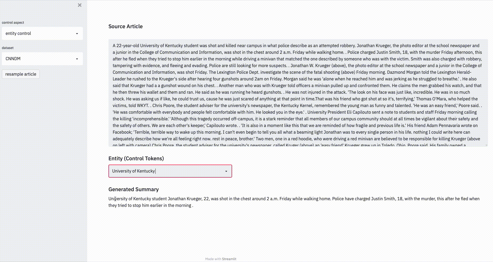
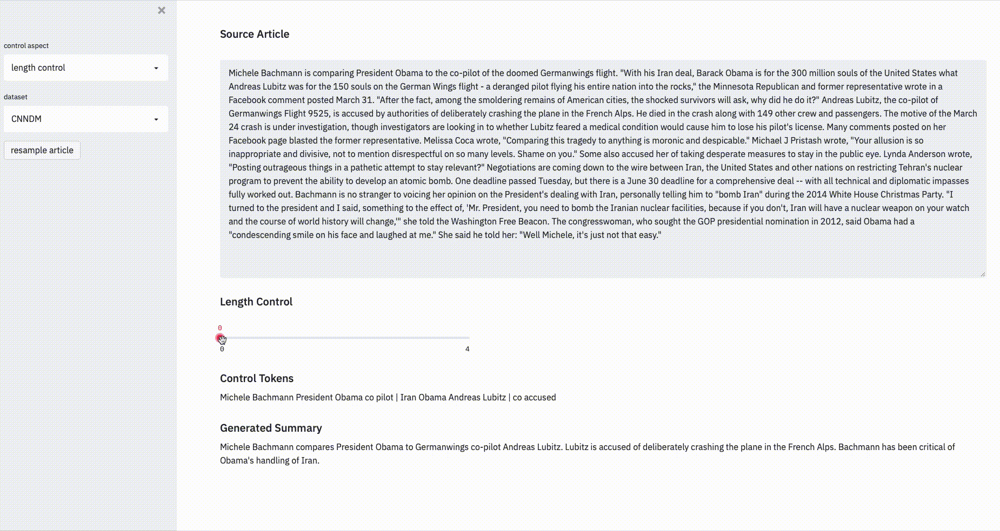
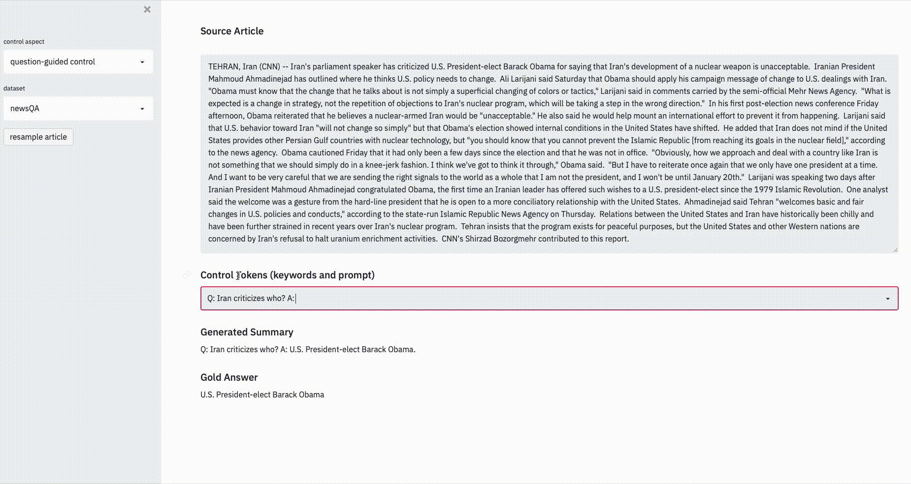

# CTRLsum --- Towards Generic, Controllable Text Summarization

#### Current summarization systems yield generic summaries that are disconnected from users' preferences.

To address this limitation, we developed CTRLsum,  a framework to enable users to control the generated summaries over multiple dimensions by interacting with the summarization system through textual input in the form of a set of keywords or descriptive prompts. CTRLsum is trained only on standard summarization datasets without extra human annotations. We have shown that CTRLsum is able to achieve a broad scope of summary manipulation with a single model. We also released the trained CTRLsum weights on several popular summarization datasets.

[[View on arXiv](https://arxiv.org/abs/2012.04281)] [[View on Github](https://github.com/salesforce/ctrl-sum)] [[Demo]()]

### CTRLsum is simple to train

In contrast with traditional summarization systems which model the distribution $p(summary | article)$, CTRLsum models $p(summary|article, keywords)$ at training time. Thus keywords are provided as additional input to train the underlying summarization model. Note that the keywords need no human annotations, and can be obtained easily using the ground-truth unconstrained summaries (details in the paper). The input at training time is simply the concatenation of keywords and article and the output is the summary; we abstract away the specific model architectures and thus CTRLsum can be trained using any seq2seq architectures or pretrained seq2seq model weights.

### CTRLsum is generic for control 

While simple, we vision that such keyword-conditioned method provides a clean separation of test-time control and the training process -- the training process is agnostic to any specific control aspect, yet we can encode mappings between control intent and keywords to achieve a broad scope of summary manipulation at inference time with a single trained model. Keywords can be further combined with prompts, which we term the combinations as *control tokens*, to achieve more flexible control. Figure 1 demonstrates the workflow of CTRLsum for control. As examples, below we demonstrate how we achieve several different dimensions of control, while we present more types of control in the paper. We refer the readers to the paper for quantitative results and detailed experiments.

*Figure1: Workflow of the CTRLsum framework at inference time. Users interact with summaries through textual control tokens in the form of keywords or prompts. Keywords are required as input during training and testing, while prompts are optionally used at test time. Dashed lines represent optional paths -- control tokens can come from the source article, user, or both. The right portion of the figure shows actual outputs from CTRLsum.*

#### Entity Control

At inference time CTRLsum can be provided with entity keywords to generate summaries that focus on the entities of interest. Figure 2 demonstrates examples that one entity is used as the keyword, while multiple entities are directedly supported as well.

 																					*Figure 2 Entity Control Demonstration*

#### Length Control

Users only need to provide the desired length, and the system selects the corresponding number of keywords obtained from a trained keyword tagger. Intuitively, more keywords usually lead to longer summaries, as shown in Figure 3.

 																					*Figure 3 Length Control Demonstration*

#### Question-Guided Summarization

Surprisingly, we found that CTRLsum is able to perform question-guided summarization in a reading comprehension setting, even though it is trained on a summarization dataset without seeing any question-answer pairs, as shown in Figure 4. From the quantitative results in our paper, CTRLsum is able to match early LSTM-based supervised QA results on the NewsQA dataset, despite being trained only on standard summarization datasets.

 																					*Figure 4 Question-Guided Control Demonstration*

### Implications

The demonstrations above are only a small subset of examples usage cases that CTRLsum can be applied to; we expect that the trained CTRLsum model can be directly used for a broader range of control scenarios without updating the model parameters. All that matters is how to map user intent to the control tokens (of course the users can directly input their own control tokens as well). For instance, topic-controlled summarization may be achieved by using the keywords in the source article that are related to the given topic, potentially utilizing pretrained word embeddings or WordNet; using simpler synonyms as keywords may lead to paraphrased summaries that are more appropriate for junior-educated population.

